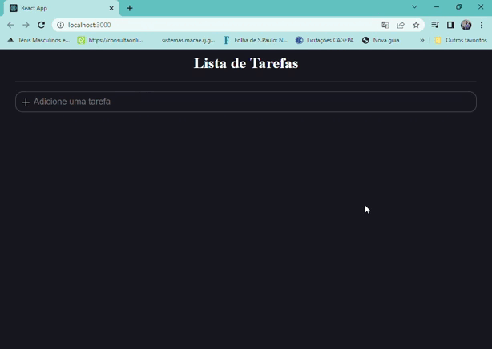

# Lista de Tarefas

> Projeto finalizado 
 

## 💻 Sobre o Projeto
Este projeto trata-se de uma lista de tarefas para seu dia á dia! incluindo tarefas pedentes e adicionando um check em suas tarefas realizadas, Foi utilizado Javascript, React, TypeScrip para o desenvolvimento deste projeto.
## 🔧Ajustes e melhorias
O projeto ainda está em desenvolvimento !

-[] Armazenar a lista no localStorage
-[] Incrementar botão de DELETE
-[] Adicionar funcionalidade no botão + para incluir mais uma tarefa

 

## ☕ tecnologias utilizadas

 

## 🤝 Colaborador

<table>
  <tr>
    <td align="center">
      <a href="#">
         
        
          <a >Gabriel Ibiapino</a>
        
      </a>
    </td>
  </tr>
</table>

  

 

[⬆ Voltar ao topo](#Lista-de-Tarefas) 